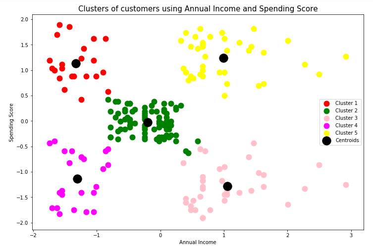

This repository contains my machine learning projects.

## Projects

### Mall Customer Segmentation using KMeans
Data source: [kaggle.com/shwetabh123/mall-customers](https://www.kaggle.com/shwetabh123/mall-customers)\
Input variables:\
  &nbsp;&nbsp;&nbsp;&nbsp;CustomerID\
  &nbsp;&nbsp;&nbsp;&nbsp;Genre\
  &nbsp;&nbsp;&nbsp;&nbsp;Age\
  &nbsp;&nbsp;&nbsp;&nbsp;Annual Income (k$\)\
  &nbsp;&nbsp;&nbsp;&nbsp;Spending Score (1-100)\
Dataset size: (200, 5)\
Resources used: Python 3.6.9, pandas, matplotlib, seaborn, sklearn\
Data preparation techniques used: StandardScaler, LabelEncoder\
Algorithms used: KMeans 

*Model performance:*

  &nbsp;&nbsp;&nbsp;&nbsp;silhouette_score = 0.443 using 'Age' and 'Annual Income' features and setting n_clusters = 3\
  &nbsp;&nbsp;&nbsp;&nbsp;silhouette_score = 0.438 using 'Age' and 'Spending Score' features and setting n_clusters = 4\
  &nbsp;&nbsp;&nbsp;&nbsp;silhouette_score = 0.554 using 'Annual Income' and 'Spending Score' features and setting n_clusters = 5\
  &nbsp;&nbsp;&nbsp;&nbsp;silhouette_score = 0.356 using 'Genre', 'Age', 'Annual Income' and 'Spending Score' features and setting n_clusters = 6
  
Scatterplot of the best performed model

### Wine quality detection
Data source: [archive.ics.uci.edu/ml/datasets/wine+quality](https://archive.ics.uci.edu/ml/datasets/wine+quality)\
Input variables:\
  &nbsp;&nbsp;&nbsp;&nbsp;type\
  &nbsp;&nbsp;&nbsp;&nbsp;fixed acidity\
  &nbsp;&nbsp;&nbsp;&nbsp;volatile acidity\
  &nbsp;&nbsp;&nbsp;&nbsp;citric acid\
  &nbsp;&nbsp;&nbsp;&nbsp;residual sugar\
  &nbsp;&nbsp;&nbsp;&nbsp;chlorides\
  &nbsp;&nbsp;&nbsp;&nbsp;free sulfur dioxide\
  &nbsp;&nbsp;&nbsp;&nbsp;total sulfur dioxide\
  &nbsp;&nbsp;&nbsp;&nbsp;density\
  &nbsp;&nbsp;&nbsp;&nbsp;pH\
  &nbsp;&nbsp;&nbsp;&nbsp;sulphates\
  &nbsp;&nbsp;&nbsp;&nbsp;alcohol\
  &nbsp;&nbsp;&nbsp;&nbsp;quality\
Dataset size: (6497, 13)\
Resources used: Python 3.6.9, pandas, numpy, matplotlib, seaborn, sklearn\
Data preparation techniques used: LabelEncoder, RobustScaler\
Algorithms used: LogisticRegression, LinearSVC, RandomForestClassifier 

*Model performance:*\
Logistic regression\
Accuracy:  0.521\
Precision:  0.610

Support vector classifier\
Accuracy:  0.414\
Precision:  0.598

Random Forest Classifier\
Accuracy:  0.68\
Precision:  0.734

### Vehicle price detection
Data source: [kaggle.com/nehalbirla/vehicle-dataset-from-cardekho](https://www.kaggle.com/nehalbirla/vehicle-dataset-from-cardekho)\
Input variables:\
  &nbsp;&nbsp;&nbsp;&nbsp;name\
  &nbsp;&nbsp;&nbsp;&nbsp;year\
  &nbsp;&nbsp;&nbsp;&nbsp;selling_price\
  &nbsp;&nbsp;&nbsp;&nbsp;km_driven\
  &nbsp;&nbsp;&nbsp;&nbsp;fuel\
  &nbsp;&nbsp;&nbsp;&nbsp;seller_type\
  &nbsp;&nbsp;&nbsp;&nbsp;transmission\
  &nbsp;&nbsp;&nbsp;&nbsp;owner\
  &nbsp;&nbsp;&nbsp;&nbsp;mileage\
  &nbsp;&nbsp;&nbsp;&nbsp;engine	\
  &nbsp;&nbsp;&nbsp;&nbsp;max_power\
  &nbsp;&nbsp;&nbsp;&nbsp;torque\
  &nbsp;&nbsp;&nbsp;&nbsp;seats\
Dataset size: (8128, 13)\
Resources used: Python, pandas, numpy, seaborn, matplotlib, sklearn\
Data preparation techniques used: OneHotEncoder, RobustScaler, SimpleImputer\
Algorithms used: XGBRegressor

*Model performance:*\
rmse:  174463.019\
mae:  71845.345\
R2:  0.95448\
R2_adjusted:  0.95427

### World_University_Rankings
Data source: [https://www.kaggle.com/mylesoneill/world-university-rankings](https://www.kaggle.com/mylesoneill/world-university-rankings)\
Input variables:\
  &nbsp;&nbsp;&nbsp;&nbsp;world_rank\
  &nbsp;&nbsp;&nbsp;&nbsp;institution\
  &nbsp;&nbsp;&nbsp;&nbsp;country\
  &nbsp;&nbsp;&nbsp;&nbsp;national_rank\
  &nbsp;&nbsp;&nbsp;&nbsp;quality_of_education\
  &nbsp;&nbsp;&nbsp;&nbsp;alumni_employment\
  &nbsp;&nbsp;&nbsp;&nbsp;quality_of_faculty\
  &nbsp;&nbsp;&nbsp;&nbsp;publications\
  &nbsp;&nbsp;&nbsp;&nbsp;influence\
  &nbsp;&nbsp;&nbsp;&nbsp;citations\
  &nbsp;&nbsp;&nbsp;&nbsp;broad_impact\
  &nbsp;&nbsp;&nbsp;&nbsp;patents\
  &nbsp;&nbsp;&nbsp;&nbsp;score\
  &nbsp;&nbsp;&nbsp;&nbsp;year\
Dataset size: (2200, 14)\
Resources used: Python, pandas, numpy, seaborn, matplotlib, sklearn\
Data preparation techniques used: OneHotEncoder, StandardScaler, KNNImputer\
Algorithms used: AdaBoostRegressor

*Model performance:*\
rmse: 48.617\
mae: 42.109\
R2: 0.974\
R2_adjusted: 0.972
